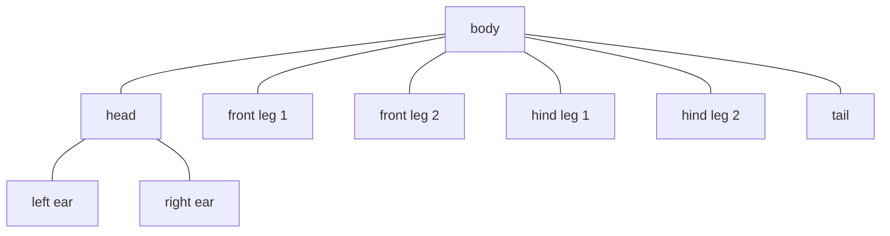
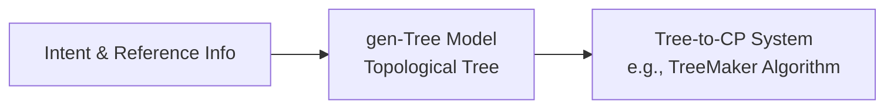

# gen-Tree Model

The **gen-Tree Model** is a proposed component designed to convert semantic requirements (such as components and symmetry groups) into a topological **tree representation** (a stick figure).

---

## 1. Objective

The tree representation is designed to serve as an interface between language models and geometric origami design algorithms. 

By focusing on topological layout (i.e., how components connect) rather than direct folding geometry, the model simplifies the initial planning stage. The geometric optimization is then handled by separate mathematical procedures.

---

## 2. The Tree Concept

In mathematical origami (such as Robert Lang's *TreeMaker*), designs are frequently initialized using a stick figure representation:
* Each leaf of the tree corresponds to a flap (appendage) in the folded model.
* The edges connect these flaps, representing the structural skeleton of the design.
* This abstraction allows the system to separate topological planning (handled by the LLM) from geometric circle packing and optimization (handled by existing mathematical algorithms).

---

## 3. Pipeline Integration

The tree model acts as the intermediate step preceding geometric CP (crease pattern) generation:

---

## 4. Proposed Parent Prediction Approach

To generate the tree structure, the project is exploring a **parent prediction** method:

* **Concept:** Instead of generating the entire tree structure in a single sequence, the model predicts hierarchical connections incrementally.
* **Workflow:**
  1. The model takes a list of structural components (e.g., `head`, `body`, `tail`, `left wing`, `right wing`).
  2. The model predicts the parent node for each component (e.g., predicting that `left wing` connects to `body`).
  3. These individual connections are combined to form a valid tree structure.

This approach is intended to output structures that remain compatible with downstream graph-based crease pattern optimization.

---

## 5. Active Research Topics

Several aspects of the gen-Tree Model remain under research and development:
* **Representation Learning:** Mapping graphs and tree structures into vector spaces.
* **Graph Encoding:** Utilizing models to evaluate and ensure the validity of generated trees.
* **Training Datasets:** Collecting and formatting examples of existing origami stick figures for model training.
