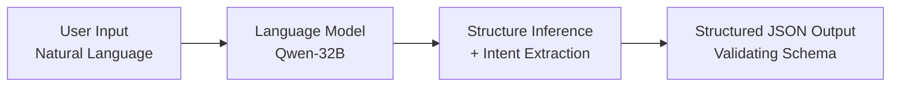

# Intent Understanding Model

The **Intent Understanding Model** is the initial component of the gen-Ori pipeline, responsible for interpreting natural language requests prior to applying geometric or mathematical folding rules.

---

## 1. Objective

The primary objective is to convert user requests into a structured, semantic JSON representation. This stage focuses on extracting:
* The target object name.
* The requested difficulty level.
* The primary structural components (e.g., body, limbs, wings) of the object.

This process is designed to run independently of origami mathematics, focusing solely on language parsing and semantic decomposition.

---

## 2. Processing Pipeline

The model utilizes a basic flow to organize unstructured text input:

### Process Steps:
1. **Intent Extraction:** The language model identifies specific attributes of the user's request, such as the object name and target difficulty.
2. **Structure Inference:** The model infers the typical physical components associated with the requested object. For example, a request for a "cat" might yield a list of components including a head, body, tail, ears, and legs.

---

## 3. Data Representation

The output of the model is structured to follow the schema defined in [intent/schema.json](../intent/schema.json):
1. **`intent`**: Overall request metadata.
   * `object` (string): The target design object.
   * `difficulty` (integer 1-5): The target difficulty level.
2. **`structure`**: An array of components (`parts`).
   * `id` (string): A unique identifier (e.g., `front_leg_01`).
   * `name` (string): The semantic name of the part.
   * `length_weight` (number or null): Estimated relative importance of the part's length.
   * `symmetry` (object or null): Symmetry metadata (such as bilateral or repeated components).

---

## 4. Current Implementation

The initial prototype is located in [intent/extractor.py](../intent/extractor.py). It:
1. Loads the JSON schema from [intent/schema.json](../intent/schema.json) and system instructions from [intent/prompt.txt](../intent/prompt.txt).
2. Formats the prompt template with the loaded schema.
3. Queries the **Groq API** (configured to use the Qwen 32B model).
4. Cleans code fences and parses the response into Python dictionary format.
