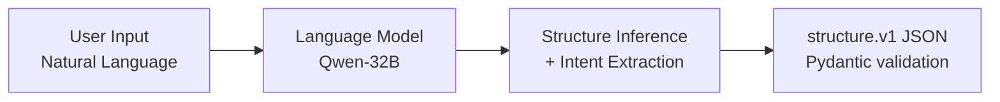

# Intent Understanding Model

The **Intent Understanding Model** is the initial component of the gen-Ori pipeline, responsible for interpreting natural language requests prior to applying geometric or mathematical folding rules.

---

## 1. Objective

The primary objective is to convert user requests into a structured, semantic JSON representation. This stage focuses on extracting:
* The target object name.
* The primary structural components (e.g., body, limbs, wings) of the object.

This process is designed to run independently of origami mathematics, focusing solely on language parsing and semantic decomposition.

---

## 2. Processing Pipeline

The model utilizes a basic flow to organize unstructured text input:

### Process Steps:
1. **Intent Extraction:** The language model identifies the requested object.
2. **Structure Inference:** The model infers the typical physical components associated with the requested object. For example, a request for a "cat" might yield a list of components including a head, body, tail, ears, and legs.

---

## 3. Data Representation

The output follows the Pydantic `StructureV1` contract in [structure/models.py](../structure/models.py), with a committed JSON Schema snapshot at [structure/schema.json](../structure/schema.json):
1. **`intent`**: Overall request metadata.
   * `object` (string): The target design object.
2. **`structure`**: An array of components (`parts`).
   * `id` (string): A unique identifier (e.g., `front_leg_01`).
   * `name` (string): The semantic name of the part.
   * `length_weight` (number or null): Estimated relative importance of the part's length.
   * `symmetry` (object or null): Symmetry metadata (such as bilateral or repeated components).

---

## 4. Current Implementation

The implementation is located in [structure/extractor.py](../structure/extractor.py). It:
1. Generates the prompt schema from the Pydantic model.
2. Queries the Groq API.
3. Cleans code fences and parses the response.
4. Rejects malformed or semantically invalid documents through `StructureV1` before the result reaches length assignment or TAN.
