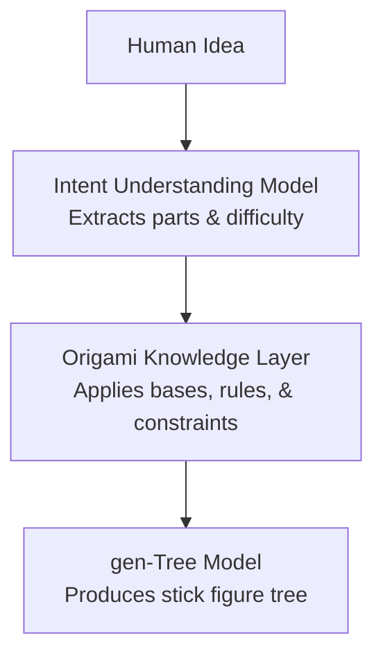

# Origami Knowledge Layer

The **Origami Knowledge Layer** is a proposed component designed to supply domain-specific reference data and rules. It assists in mapping general semantic concepts to specific origami structures.

---

## 1. Objective

While general-purpose language models handle broad semantics, they do not inherently incorporate the specific mathematical rules and conventions of origami design. The Knowledge Layer is intended to supply this supplementary context to assist the generation process.

It provides reference information such as:
* **Object Structures:** The physical features typically required to represent a given subject.
* **Symmetry Profiles:** Rules for identifying mirrored or repeated components (e.g., bilateral symmetry).
* **Common Bases:** Traditional origami starting shapes (e.g., bird base, frog base) associated with the target structure.
* **Design Guidelines:** Basic mathematical and geometric constraints used in design.

---

## 2. Pipeline Integration

The Knowledge Layer is designed to sit between initial language parsing and tree structure planning:



---

## 3. Initial Prototype

The initial implementation relies on static JSON configuration files under a planned `knowledge/` directory:

* `knowledge/animals.json`: Blueprints and typical symmetry profiles for common animals.
* `knowledge/bases.json`: Attributes of standard origami bases.
* `knowledge/symmetry.json`: Basic constraints for handling mirrored components.
* `knowledge/techniques.json`: Reference list of folding methods.
* `knowledge/design_rules.json`: Mathematical reference rules.
* `knowledge/topology_difficulty.json`: Guidelines mapping structural complexity to difficulty.

### Example Reference Entry (e.g., `cat`):
```json
{
  "cat": {
    "category": "animal",
    "symmetry": "bilateral",
    "parts": [
      "head",
      "body",
      "four legs",
      "tail",
      "ears"
    ],
    "recommended_structures": [
      "quadruped"
    ]
  }
}
```

---

## 4. Potential Future Evolution

As the system grows, manual maintenance of static JSON files may limit scalability. Potential areas for future exploration include:
* **Retrieval-Augmented Generation (RAG):** Dynamically supplying relevant design constraints or historical examples to the LLM prompt.
* **Vector Databases & Embeddings:** Retrieving similar folding structures based on semantic meaning rather than exact keywords.
* **Knowledge Graphs:** Structuring relationships between bases, fold patterns, and physical components.
