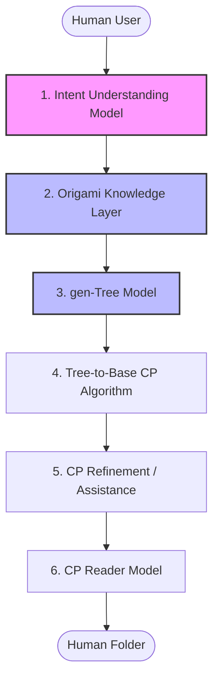

# gen-Ori System Overview & Philosophy

**gen-Ori** is a research project exploring an AI-assisted origami design workflow. The goal is to assist in translating user concepts into representations that can interface with existing mathematical origami design methods.

Rather than attempting to generate a final crease pattern directly from a natural language prompt, gen-Ori divides the design process into modular steps, like how a human origami designer does. This approach aims to transform abstract ideas into structured representations before computing a final foldable design.

---

## 1. Overall Philosophy

> **Core Premise:** The system is proposed to assist in understanding human intent and interfacing with existing origami mathematics, rather than replacing mathematical methods.

Origami design relies on strict geometric rules. To handle this complexity, gen-Ori proposes using generative models for semantic planning (such as identifying components and layout) and relying on established mathematical algorithms (such as TreeMaker-style circle packing) for geometric optimization.

---

## 2. Proposed System Pipeline

The project outlines a multi-stage pipeline to transition from user input to folding instructions:

### Component Descriptions:
1. **Intent Understanding Model:** Interprets natural language requests and extracts structural details (e.g., requested object, difficulty, and physical components).
2. **Origami Knowledge Layer:** A proposed component designed to supply domain constraints (such as symmetry rules and base suggestions) related to the requested object.
3. **gen-Tree Model:** Plans the topological structure of the design as a tree representation (stick figure) of flap allocations.
4. **Tree-to-Base CP System:** Utilizes existing mathematical algorithms (e.g., circle packing) to convert the tree representation into a base crease pattern (CP).
5. **CP Refinement / Assistance:** Suggests minor geometric adjustments and proportions to finalize the crease pattern.
6. **CP Reader:** A proposed model to translate crease patterns into step-by-step, human-readable folding instructions.

---

## 3. Current Development Focus

The initial prototype concentrates on the first three components:
* **Intent Understanding Model** (implemented in [intent/extractor.py](../intent/extractor.py))
* **Origami Knowledge Layer**
* **gen-Tree Model**
